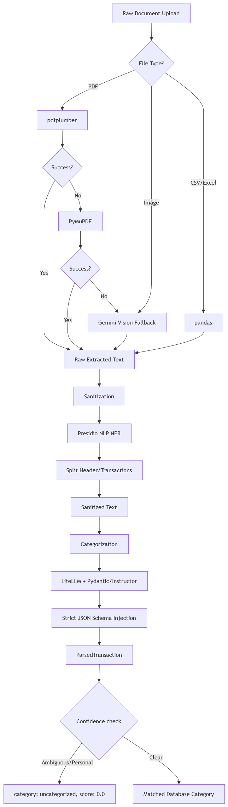

# AI Categorization Service: Architecture & Implementation Report

## 1. Overview
The AI Categorization module is a self-contained backend microservice designed to ingest raw financial documents (bank statements, receipts), sanitize them of Personally Identifiable Information (PII) for security, and use Large Language Models (LLMs) to automatically categorize each transaction according to complex predefined tax rules.

## 2. Execution Flow & Pipeline Logic
The service follows a strict, linear pipeline to guarantee security and deterministic outputs:
1. **Parsing (Data Extraction):** Ingests PDF/CSV files and converts them into raw text using a tiered, local-first fallback strategy.
2. **Sanitization (Security):** Strips names, phone numbers, and sensitive entities from the raw text using NLP models.
3. **Categorization (AI Generation):** Injects the sanitized text and business rules into a structured LLM prompt, forcing a strict JSON schema output.
4. **Validation (Data Integrity):** Ensures the LLM output strictly matches predefined categories (e.g., `taxed_salary_paye`, `exp_software_subscriptions`) before sending the data to the frontend or database.

### Categorization Pipeline Flowchart

## 3. Technologies & Tools Used

### Core Frameworks
* **Python 3.12 & Poetry:** Used for strict dependency locking and environment isolation, ensuring ML packages (like Presidio and Spacy) run correctly without system conflicts.
* **FastAPI:** Used to expose the pipeline as a highly performant RESTful API to the frontend.

### Parsing & Extraction Tier
We use a tiered local fallback architecture for parsing. This avoids sending raw data to paid cloud services (like Gemini) immediately, drastically reducing costs and latency. CSV and Excel files are parsed into dataframes while PDFs are parsed into raw text using a tiered strategy:
* **`pdfplumber`:** The primary local pdf parser. Highly accurate for digitally generated, native bank statements with complex tabular grids.
* **`PyMuPDF` (`pymupdf`):** The secondary local pdf parser. A blazingly fast C-based parser for complex visual layouts that `pdfplumber` might struggle with.
* **`gemini-3.5-flash` (Vision Fallback):** If all local methods fail (e.g., for scanned images of documents), the raw file is sent to Google's Gemini Vision API for multimodal text extraction.

> **Engineering Note (The Data Extraction Timeline & Trial-and-Error):** 
> 1. **Initial Design:** We built the extraction tier strictly using `pdfplumber` and `PyMuPDF`. This failed when users uploaded scanned images of bank statements (where the text is baked into the image).
> 2. **Tesseract OCR Integration:** To fix the image issue while remaining strictly zero-trust and local, we introduced `pytesseract`.
> 3. **The Tesseract Hallucination:** We quickly discovered that Tesseract (even with `--psm 6` for layout preservation) is fundamentally incapable of perfectly parsing complex financial tables. It scrambled rows and, fatally, hallucinated numbers (e.g., misreading `₦35,000` as `435,000` due to noise). In financial software, OCR inaccuracies are catastrophic.
> 4. **Local Vision LLMs Evaluated:** We evaluated local Vision LLMs (like Moondream2 or Sparrow/Donut) to replace Tesseract, but they either hallucinate dense tables worse than Tesseract (Moondream2) or require massive PyTorch dependencies and dedicated GPUs (Surya/Sparrow).
> 5. **Final Decision (Academic Project Trade-off):** We removed Tesseract entirely and defaulted the fallback to **Gemini Vision (Google AI Studio)**. We acknowledge that sending raw images to a consumer cloud model breaks absolute zero-trust privacy, as the provider may log inputs. However, because this is an academic/final year project prioritizing data extraction perfection over production-grade compliance, we accept this trade-off to achieve **100% extraction accuracy**. In a real-world enterprise deployment, this would simply be migrated to **Google Cloud Vertex AI** to guarantee zero data retention.

### Security Tier
* **Microsoft Presidio (`presidio-analyzer`, `presidio-anonymizer`):** An open-source NLP framework that uses Spacy models to detect and mask PII (names, emails, account numbers) locally.
* **Targeted Sanitization (Header vs. Transactions):** If we redact every person and location, the AI loses the merchant names needed for categorization (e.g., losing the sender of a transfer). We implemented contextual splitting: we aggressively run Presidio (with custom Regex recognizers for ALL CAPS names and Nigerian geographic locations) on the document's Header to wipe the account owner's profile. We then turn off Name/Location scrubbing for the Transactions block to preserve merchant context.

> **Engineering Note (Lazy Loading):** The Spacy NLP model used by Presidio is ~500MB. Initially, initializing this model at the module level caused the entire application to hang for over a minute on startup. We implemented **Lazy Loading** (Singleton pattern) so the model is only loaded into RAM exactly when the first sanitization request is made.

### AI & LLM Tier (The Service Layer)
* **`LLMService` (Facade Pattern):** All AI logic (`litellm`, `instructor`) is locked inside a centralized Singleton class (`services/llm_service.py`). This prevents vendor lock-in, handles SDK quirks (like the deprecation of `temperature` parameters in Gemini 3.5), and provides a single choke-point for future logging and rate-limiting.
* **LiteLLM:** A universal LLM API wrapper allowing the backend to instantly switch models (Gemini, OpenAI, Claude).
* **Instructor & Pydantic:** Forces the AI to output rigid JSON that maps perfectly to our `ParsedTransaction` schema (including `merchant_name` and `income_source`).
* **Rate Limit Fallbacks:** To avoid latency caused by exponential backoff, the `LLMService` automatically cascades through lighter models (`gemini-3.6-flash` -> `gemini-2.5-flash` -> `gemini-3.5-flash-lite`) if a `429 Resource Exhausted` error is encountered.

## 4. Prompt Engineering & Business Logic
The AI's decision-making is heavily constrained by strict prompt instructions to avoid hallucination:
1. **Predefined Database Categories:** The AI cannot hallucinate categories. It is fed a direct list of `developer_slugs` and descriptions from the database (via `categories.json`) and is forced to pick one.
2. **Deterministic Rules:**
   * **The Expense Rule:** *"Categorize personal or non-business expenses (like stamp duty or self-transfers) as `uncategorized` with a confidence score of `0.0`, unless they explicitly fall into an accepted business predefined category. (User custom rules override this)."*
   * **The Golden Rule for Financial Data (No Omission):** Through trial and error, we discovered that instructing the AI to "ignore" or "omit" personal transactions is dangerous, as the user permanently loses that data in the app. Instead, the AI is instructed to return all personal/ignored expenses but force their `category_slug` to `uncategorized`. This allows the user to see the transaction and write custom rules for it in the future.

## 5. Architectural Advantages
* **Cost Efficiency:** The local-first parsing strategy avoids paying for cloud APIs on every document.
* **Human-In-The-Loop Safety:** By forcing the AI to output a `confidence_score` (and defaulting to `0.0` and `uncategorized` for ambiguous items), the system naturally flags transactions for human review rather than making dangerous, silent guesses.
* **Database Alignment:** By utilizing `Pydantic` and `Instructor`, the pipeline guarantees that the API response will always match the rigid requirements of the `SQLAlchemy` ORM, preventing database crashes.

# Phase 1 Review: Data Structures & Lessons Learned

This document summarizes the technical data structures and the crucial engineering lessons learned during the development of the AI Categorization, Parsing, and Sanitization pipelines. 

## 1. Core Data Structures

### Pydantic Models (The LLM Contract)
To prevent the LLM from returning messy or unpredictable JSON, we strictly enforced the output using Pydantic models via the `instructor` library.
* **`ParsedTransaction`**: The source of truth for a single row of financial data.
  * Fields: `date` (date), `description` (str), `amount` (float), `category_slug` (str), `transaction_type` (Literal["Income", "Expense"]), `confidence_score` (float), `merchant_name` (Optional[str]), `income_source` (Optional[str]).
* **`TransactionExtraction`**: A wrapper model containing a `List[ParsedTransaction]`. This is required to force the LLM to return an array of objects rather than a single object.

### Memory & File Handling
* **`bytes` / `io.BytesIO`**: Used extensively to keep uploaded files strictly in RAM. We never write the user's raw bank statement to the server's hard drive, improving both speed and security.
* **`pd.DataFrame` (Pandas)**: Used as the intermediate structural representation for `.csv` and `.xlsx` files before converting them into raw string format (`df.to_string(index=False)`).

### PDF Parsers
* **`pdfplumber.pdf.PDF`**: Used for native, digitally generated PDFs. It excels at understanding spatial grids and tables.
* **`pymupdf.Document`**: Used as a high-speed fallback for complex layouts that `pdfplumber` fails to read natively.

---

## 2. Key Lessons Learned & Engineering Decisions

### 1. The Fatal Flaw of Traditional OCR in Finance
We initially integrated **Tesseract OCR** (`pytesseract`) to read scanned images locally to preserve privacy. However, we discovered a fatal flaw: Tesseract hallucinated a `4` out of noise/currency symbols, turning `₦35,000` into `435,000`. 
* **Lesson:** In a financial application, a single digit hallucination destroys the user's trust and breaks their account balance. Traditional OCR is too dangerous for financial amounts. 

### 2. The Cloud Privacy vs. Accuracy Trade-off
To fix the OCR hallucination without using massive PyTorch models locally (which are too heavy for standard servers), we fell back to **Gemini Vision**.
* **Lesson:** There is a strict trade-off between edge-computing privacy and absolute accuracy. For this academic project, we chose 100% accuracy using consumer Gemini Vision. We learned that in a real enterprise environment, this trade-off is resolved by paying for enterprise cloud tools like **Google Cloud Vertex AI**, which legally guarantees zero data retention.

### 3. Targeted Sanitization is Better Than Blanket Sanitization
We integrated **Microsoft Presidio** to scrub PII before sending data to the LLM. Initially, scrubbing the whole document destroyed merchant names, making it impossible to know who money was sent to or received from.
* **Lesson:** We learned to spatially split the document. We apply aggressive PII scrubbing strictly to the **Header** (where the customer's address and account details live) and leave the **Transactions** intact. We also learned to inject prompt instructions to tell the LLM to redact account numbers on the fly.

### 4. NLP Models Lack Local Context
The default Spacy NLP model failed to recognize Nigerian states and ALL-CAPS names. 
* **Lesson:** Off-the-shelf NLP models are inherently biased towards Western addresses and sentence-case grammar. We learned how to write custom `PatternRecognizer` instances in Presidio to inject the 36 Nigerian states and custom regex for capitalization.

### 5. The Golden Rule of AI Extraction: No Omission
Initially, we told the AI to "ignore" personal expenses or stamp duties.
* **Lesson:** Instructing an LLM to "ignore" data causes permanent data loss in the app. We learned to flip the instruction: the LLM must extract *everything*, but flag ignored transactions by setting their `category_slug` to `uncategorized` and `confidence_score` to `0.0`. This keeps the human-in-the-loop and prevents silent data deletion.

### 6. Lazy Loading is Critical for ML Models
Loading the `en_core_web_lg` Spacy model took several seconds, which would cause API timeouts on every request.
* **Lesson:** We learned to implement **Lazy Loading** (Global Singletons) in Python. The heavy NLP model is loaded exactly once into RAM when the server starts, rather than every time the sanitization function is called.

### 7. Handling Password-Protected PDFs
Many financial institutions encrypt their PDF statements with a password (e.g., the user's date of birth or account number).
* **Lesson:** We cannot silently fail or fallback to a vision model when a file is locked. We implemented a `PasswordRequiredError` in the parsing tier. When this is thrown, the API returns an `HTTP 423 Locked` status, prompting the frontend to ask the user for their password, which is then passed back in memory to unlock the file.

### 8. LLM Rate Limit Fallbacks vs. Retries
When hitting rate limits (e.g., HTTP 429) on the primary LLM model, the standard approach is to use exponential backoff (retries).
* **Lesson:** For user-facing API endpoints, retries introduce unacceptable latency (waiting seconds before retrying). We opted for an immediate fallback chain (`gemini-3.6-flash` -> `gemini-2.5-flash` -> `gemini-3.5-flash-lite`), prioritizing low latency over maximal reasoning power when the system is under load.
